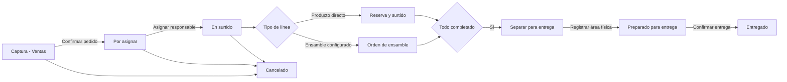

# KAN-133 - Mapa operativo de pedido ventas a almacén

Fecha de corte: 2026-07-30

Estado: borrador de proceso basado en la implementación y evidencia AWS actual
Ámbito: pedido comercial directo, ensamble configurado y pedido mixto

## Propósito

Definir un único proceso operativo desde la captura comercial hasta la entrega
al cliente. Este documento describe el comportamiento existente que ha sido
verificado en código y en AWS; no declara que todos los requisitos posteriores
de KAN-127 a KAN-132 estén terminados.

La fuente técnica de los estados es `lib/sales/internal-orders.ts`. La fuente
operativa de validación es la aplicación AWS Dev y PostgreSQL RDS. Las fechas
de compromiso son días de negocio; las marcas de auditoría son instantes.

## Actores y responsabilidad

| Actor | Responsabilidad | No puede hacer |
|---|---|---|
| Ejecutivo de Ventas | Captura, confirma el pedido, consulta promesa y da seguimiento comercial. Puede confirmar entrega sólo si se cumplen todas las precondiciones. | Surtir directamente ni preparar físicamente la entrega sin permiso operativo. |
| Manager / Administrador | Supervisa, asigna o reasigna antes de la toma, atiende excepciones y puede intervenir según RBAC. | Saltar las validaciones de surtido, ensamble, preparado o entrega. |
| Operador de almacén | Libera y ejecuta surtido directo, registra faltantes y prepara físicamente el pedido para entrega. | Prometer disponibilidad comercial ni declarar entrega al cliente. |
| Producción / ensamble | Completa las órdenes de ensamble configuradas ligadas a la línea comercial. | Marcar el pedido listo o entregado mientras haya trabajo pendiente. |
| Sistema / auditoría | Crea reservas, listas de surtido, tareas, movimientos y eventos auditables. | Convertir una condición no cumplida en una transición válida. |

## Estados canónicos visibles

| Etapa visible | Condición de entrada | Propietario de la siguiente acción | Condición de salida | Evidencia requerida |
|---|---|---|---|---|
| Captura | Pedido `BORRADOR`. | Ventas. | Cliente, almacén, fecha y al menos una línea válidos; Ventas confirma. | Pedido y líneas guardadas. |
| Por asignar | Pedido `CONFIRMADA` sin responsable. | Manager / Administrador. | Responsable asignado. | `assignedToUserId`, `assignedAt` y evento de asignación. |
| En surtido | Pedido confirmado y asignado, con surtido directo o ensamble pendiente. | Almacén o Producción, según la línea. | Surtido directo completo y todos los ensambles requeridos completos. | Lista de surtido/tareas y órdenes de producción ligadas. |
| Separar para entrega | Surtido directo completo y ensambles completos, sin ubicación física de entrega. | Almacén. | Se registra área de entrega. | `preparedForDeliveryAt`, ubicación, usuario y nota opcional. |
| Preparado para entrega | Área de entrega registrada y trabajo requerido completado. | Ventas responsable, Manager o Administrador. | Se confirma la entrega al cliente. | Validación de entrega y evento de auditoría. |
| Entregado | `deliveredToCustomerAt` registrado. | Ninguno; sólo consulta y comprobante. | Terminal. | Usuario, fecha y PDF de entrega. |
| Cancelado | Pedido cancelado. | Ninguno; sólo consulta y auditoría. | Terminal. | Evento de cancelación y liberación aplicable. |

## Flujo principal

## Reglas de negocio que bloquean transiciones

1. Un pedido sólo puede confirmarse desde `BORRADOR` y con al menos una línea.
2. La promesa de disponibilidad se revalida contra el almacén antes de crear el
   pedido; la evidencia KAN-128 visible se conserva en el flujo comercial.
3. Al confirmar líneas directas, el sistema crea una lista de surtido en
   borrador, reserva cantidades y genera tareas por ubicación.
4. Una tarea no puede confirmarse hasta que la lista de surtido esté liberada.
5. Un pedido no puede prepararse para entrega hasta que el surtido directo esté
   completado y todos los ensambles configurados ligados estén completados.
6. Un pedido no puede entregarse si falta responsable/toma, surtido directo,
   ensamble, área de entrega o si ya fue entregado.
7. Cancelar libera las reservas de listas aún en borrador; no puede ocultar una
   operación ya liberada o una condición de inventario incompatible.

## Diferencia por tipo de pedido

| Caso | Trabajo operativo | Criterio para avanzar a preparado |
|---|---|---|
| Directo | Lista de surtido y tareas desde ubicación origen hasta área de entrega. | Lista de surtido en `COMPLETED`. |
| Ensamble | Orden de producción ligada a la línea configurada. | Todas las órdenes ligadas en `COMPLETADA`. |
| Mixto | Surtido directo y ensamble en paralelo. | Ambos criterios anteriores se cumplen. |

## Evidencia AWS usada como referencia

El pedido controlado `PI-2026-0010` muestra la cadena ya existente:

- producto `DEV-ASM-HOSE-DN10-R2AT` en almacén `WH-02`;
- disponibilidad comercial actual: 19;
- pedido confirmado con una unidad;
- reserva existente y tarea de surtido pendiente;
- lista `PK-SUR-2026-0005` con destino `STAGING-WH-02`.

Esta evidencia demuestra disponibilidad, confirmación, reserva y handoff; no
autoriza por sí misma el cierre de las historias posteriores.

## Excepciones y decisiones

| Excepción | Estado esperado | Responsable | Acción visible |
|---|---|---|---|
| Promesa insuficiente o vencida | No se crea compromiso válido. | Ventas. | Revisar disponibilidad o equivalente. |
| Sin responsable | Por asignar. | Manager / Administrador. | Asignar o reasignar. |
| Faltante al surtir | En surtido, con bloqueo/parcial. | Almacén y supervisión. | Registrar faltante y revisar excepción. |
| Ensamble incompleto | En surtido. | Producción. | Completar ensamble o resolver bloqueo. |
| Área de entrega ausente | Separar para entrega. | Almacén. | Registrar ubicación física. |
| Intento de entrega prematura | Sin transición. | Sistema. | Mostrar condición bloqueante. |

## Límites actuales y trabajo posterior

Este mapa confirma que el modelo actual ya contiene los hitos principales. Los
siguientes tickets convierten el proceso en contrato y experiencia consistente:

1. **KAN-127:** formalizar eventos, permisos, idempotencia, errores y auditoría.
2. **KAN-131:** asegurar que la cola de almacén muestre sólo trabajo accionable.
3. **KAN-134:** completar el detalle del retorno de ensamble al pedido comercial.
4. **KAN-132:** endurecer la evidencia y UX de preparado para entrega.
5. **KAN-130:** certificar directo, ensamble, mixto y excepciones mediante E2E.
6. **KAN-125:** cerrar la capacidad integral sólo con evidencia operativa de toda la cadena.

## Gate de revisión KAN-133

KAN-133 puede considerarse revisada cuando Producto/Operación confirme que:

- los siete estados visibles corresponden a su operación real;
- la propiedad de cada transición es correcta;
- las excepciones cubren faltantes, ensambles y cancelación;
- no existe una transición administrativa que permita entregar antes de estar
  preparado;
- el mapa se enlace desde KAN-125 o desde la PR que introduzca KAN-127.
