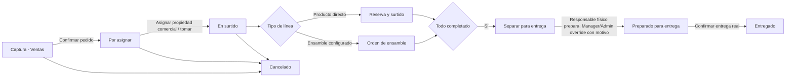

# KAN-133 - Mapa operativo de pedido ventas a almacén

Fecha de revisión estructural/código: 2026-10-01 UTC

Estado: mapa revisado contra criterios Jira y código actual. Aceptación global AWS, runtime y cierre de tickets siguen pendientes de evidencia de release; esta revisión documental no los certifica.
Ámbito: pedido comercial directo, ensamble configurado y pedido mixto

## Propósito

Definir un único proceso operativo desde la captura comercial hasta la entrega
al cliente. Este documento distingue reglas encontradas en código de la
aceptación operativa global, que continúa pendiente.

Fuentes de revisión: `lib/sales/internal-orders.ts`,
`lib/sales/request-service.ts` y las vistas/acciones de Ventas y Almacén. Las
fechas de compromiso son días de negocio; las marcas de auditoría son instantes.

## Actores y responsabilidad

| Actor | Responsabilidad | No puede hacer |
|---|---|---|
| Ejecutivo de Ventas | Captura, confirma, toma/retira la propiedad comercial y da seguimiento. La propiedad comercial usa `assignedToUserId`/`assignedAt`; la toma se registra con `pulledAt`. Puede confirmar entrega si cumple las precondiciones. | Surtir ni preparar físicamente por el solo hecho de ser responsable comercial. |
| Manager / Administrador | Supervisa, asigna o reasigna propiedad comercial y trabajo físico según RBAC, resuelve excepciones. Puede preparar como override sólo registrando motivo. | Saltar las validaciones de surtido, ensamble, preparado o entrega. |
| Operador de almacén | Ejecuta el trabajo físico. La propiedad de almacén se representa por `warehouseAssigneeUserId`; reclamar registra `warehouseClaimedByUserId`/`warehouseClaimedAt`. El asignado o quien reclamó puede preparar el pedido. | Prometer disponibilidad comercial ni declarar entrega al cliente. |
| Producción / ensamble | Completa las órdenes de ensamble configuradas ligadas a la línea comercial. | Marcar el pedido listo o entregado mientras haya trabajo pendiente. |
| Sistema / auditoría | Crea reservas, listas de surtido, tareas, movimientos y eventos auditables. | Convertir una condición no cumplida en una transición válida. |

## Estados canónicos visibles

| Etapa visible | Condición de entrada | Propietario de la siguiente acción | Condición de salida | Evidencia requerida |
|---|---|---|---|---|
| Captura | Pedido `BORRADOR`. | Ventas. | Cliente, almacén, fecha y al menos una línea válidos; Ventas confirma. | Pedido y líneas guardadas. |
| Por asignar | Pedido `CONFIRMADA` sin responsable comercial. | Manager / Administrador. | Responsable comercial asignado; el ejecutivo elegible toma el pedido. | `assignedToUserId`, `assignedAt`, `pulledAt` y eventos correspondientes. |
| En surtido | Pedido confirmado y tomado/comercialmente asignado, con surtido directo o ensamble pendiente. | Responsable físico de almacén y Producción, según la línea. | Surtido directo completo y todos los ensambles requeridos completos. | Lista/tareas, `warehouseAssigneeUserId` o reclamación física y órdenes de producción ligadas. |
| Separar para entrega | Surtido directo completo y ensambles completos, aún sin preparación registrada. | Responsable físico asignado/reclamante; Manager/Admin puede intervenir con motivo. | Servicio valida el área activa del almacén y registra preparado. | `preparedForDeliveryAt`, ubicación y actor; nota opcional salvo override, donde el motivo es obligatorio. |
| Preparado para entrega | `preparedForDeliveryAt` registrado tras completar trabajo requerido. | Ventas responsable para confirmar la entrega; Manager/Admin sólo conforme a la regla de excepción y motivo. | Se registra la entrega real al cliente. | Separación explícita entre preparación y entrega: marcas, actores y auditoría distintas. |
| Entregado | `deliveredToCustomerAt` registrado. | Ninguno; sólo consulta y comprobante. | Terminal. | Usuario, fecha y PDF de entrega. |
| Cancelado | Pedido cancelado. | Ninguno; sólo consulta y auditoría. | Terminal. | Evento de cancelación y liberación aplicable. |

## Matriz de transiciones, validación y visibilidad

Ninguna transición operativa es sólo de interfaz: cada una que cambia el
pedido, una reserva, una lista de surtido, una excepción, una devolución o una entrega requiere validación de
backend. La interfaz sólo presenta el estado, la siguiente acción y el motivo
de bloqueo; no puede sustituir las reglas de servicio.

| Transición | Validación backend obligatoria | Presentación para Ventas | Presentación para Almacén / Producción | Supervisión |
|---|---|---|---|---|
| Captura → Por asignar | Pedido `BORRADOR`, cliente, almacén, fecha y líneas válidos; promesa revalidada y reserva/lista creada cuando aplica. Backend valida y crea compromisos; la etiqueta/vista es UI. | Confirma y ve `Por asignar`. | No recibe trabajo hasta confirmación y asignación. | Puede asignar la propiedad comercial; esto no equivale a asignar trabajo físico. |
| Por asignar → En surtido | Backend valida asignación/toma comercial y evita duplicar o tomar pedido cancelado. | Ejecutivo elegible ve `Tomar pedido`/`Continuar pedido`, propietario o bloqueo. | Cola presenta trabajo físico elegible; assignment/claim físico se valida aparte. | Puede asignar/reasignar según RBAC antes de la toma. |
| En surtido → Separar para entrega | Surtido directo completado y todos los ensambles configurados ligados completados. | Ve seguimiento y bloqueo mientras falte trabajo físico. | Ejecuta surtido o ensamble; al completarse recibe `Preparar pedido`. | Ve el avance y atiende excepciones. |
| Separar para entrega → Preparado para entrega | Backend exige surtido/ensamble completo, sin excepción abierta, área activa compatible y almacén correcto; sólo responsable físico asignado/reclamante o Manager/Admin. Override requiere motivo. | Ve `En espera de almacén`/preparación pendiente. | El responsable físico prepara; Manager/Admin puede override con motivo auditado. | Estado y botones son UI; autorización, precondiciones y auditoría son backend. |
| Preparado para entrega → Entregado | Backend exige pedido confirmado/tomado, surtido y ensamble completos, área registrada, sin excepción y datos de recepción/método requeridos. | Responsable comercial confirma la entrega real; no confundir con preparación. | Ve el estado preparado, sin declarar por ello recepción del cliente. | No se salta la validación; cambios y etiquetas de vista son UI. |
| Activo → Solicitud de cancelación → Cancelado | Si el surtido ya fue liberado se crea una excepción, Manager/Admin decide, Almacén realiza reversión física y sólo entonces se confirma cancelación. | Ve el bloqueo y seguimiento. | Recibe reversión física antes del cierre. | Gestiona decisión y auditoría. |

Los indicadores, tarjetas, etiquetas de etapa, PDFs de consulta y enlaces de
navegación son **UI-only**: reflejan el estado calculado, pero no autorizan ni
ejecutan transiciones por sí mismos.

## Flujo principal

```mermaid
flowchart LR
  A["Captura - Ventas"] -->|"Confirmar pedido"| B["Por asignar"]
  B -->|"Asignar propiedad comercial / tomar"| C["En surtido"]
  C --> D{"Tipo de línea"}
  D -->|"Producto directo"| E["Reserva y surtido"]
  D -->|"Ensamble configurado"| F["Orden de ensamble"]
  E --> G{"Todo completado"}
  F --> G
  G -->|"Sí"| H["Separar para entrega"]
  H -->|"Responsable físico prepara; Manager/Admin override con motivo"| I["Preparado para entrega"]
  I -->|"Confirmar entrega real"| J["Entregado"]
  A --> K["Cancelado"]
  B --> K
  C --> K
```

## Reglas de negocio que bloquean transiciones

1. Un pedido sólo puede confirmarse desde `BORRADOR` y con al menos una línea.
2. La promesa de disponibilidad se revalida contra el almacén antes de crear el
   pedido; la evidencia KAN-128 visible se conserva en el flujo comercial.
3. Al confirmar líneas directas, el sistema crea una lista de surtido en
   borrador, reserva cantidades y genera tareas por ubicación.
4. Una tarea no puede confirmarse hasta que la lista de surtido esté liberada.
5. Un pedido no puede prepararse para entrega hasta que el surtido directo esté
   completado y todos los ensambles configurados ligados estén completados.
6. Un pedido no puede entregarse si falta responsable/toma, surtido directo,
   ensamble, área de entrega, evidencia mínima de entrega o existe una excepción abierta.
7. Cancelar libera reservas de listas aún en borrador. Si existe surtido liberado,
   crea una solicitud de cancelación y exige decisión, reversión física y auditoría.
8. Un pedido entregado inicia una devolución; nunca se convierte en cancelación.

Para registrar preparación, el servicio acepta una ubicación activa `STAGING`
del almacén del pedido. La selección predeterminada prioriza primero
`STAGING-${warehouse.code}`, luego otra ubicación `STAGING` activa por código,
y usa una ubicación `SHIPPING` activa por código sólo como fallback. Si no hay
ninguna, la preparación se rechaza. El destino de la evidencia histórica
`STAGING-WH-02` no afirma que esa ubicación exista o esté activa actualmente.

## Diferencia por tipo de pedido

| Caso | Trabajo operativo | Criterio para avanzar a preparado |
|---|---|---|
| Directo | Lista de surtido y tareas desde ubicación origen hasta área de entrega. | Lista de surtido en `COMPLETED`. |
| Ensamble | Orden de producción ligada a la línea configurada. | Todas las órdenes ligadas en `COMPLETADA`. |
| Mixto | Surtido directo y ensamble en paralelo. | Ambos criterios anteriores se cumplen. |

## Evidencia histórica AWS (no disponibilidad actual)

El pedido controlado `PI-2026-0010` muestra la cadena ya existente:

- producto `DEV-ASM-HOSE-DN10-R2AT` en almacén `WH-02`;
- snapshot histórico reportó disponibilidad comercial 19 en la observación de origen; no garantiza disponibilidad actual;
- pedido confirmado con una unidad;
- reserva existente y tarea de surtido pendiente;
- lista `PK-SUR-2026-0005` con destino `STAGING-WH-02`.

Este registro se conserva como evidencia histórica de confirmación/reserva y
handoff. No prueba inventario disponible hoy, runtime actual ni aceptación AWS
global, y no autoriza por sí mismo cierre de historias.

## Excepciones y decisiones

La implementación persistente usa `SalesInternalOrderException` para faltantes
y solicitudes de cancelación, y `SalesInternalOrderReturn` para reversión de
surtido y devolución del cliente. Estos registros conservan actor, fecha,
motivo, decisión, ubicación y disposición física; además bloquean preparación
y entrega mientras permanezcan abiertos.

| Excepción | Estado esperado | Responsable | Acción visible |
|---|---|---|---|
| Promesa insuficiente o vencida | No se crea compromiso válido. | Ventas. | Revisar disponibilidad o equivalente. |
| Sin responsable | Por asignar. | Manager / Administrador. | Asignar o reasignar. |
| Faltante al surtir | En surtido, con bloqueo/parcial. | Almacén y supervisión. | Registrar faltante y revisar excepción. |
| Ensamble incompleto | En surtido. | Producción. | Completar ensamble o resolver bloqueo. |
| Área de entrega ausente | Separar para entrega. | Almacén. | Registrar ubicación física. |
| Intento de entrega prematura | Sin transición. | Sistema. | Mostrar condición bloqueante. |

## Límites actuales y trabajo posterior

Este mapa confirma que el modelo actual ya contiene los hitos principales. Los
siguientes tickets convierten el proceso en contrato y experiencia consistente:

1. **KAN-127:** formalizar eventos, permisos, idempotencia, errores y auditoría.
2. **KAN-131:** asegurar que la cola de almacén muestre sólo trabajo accionable.
3. **KAN-134:** completar el detalle del retorno de ensamble al pedido comercial.
4. **KAN-132:** endurecer la evidencia y UX de preparado para entrega.
5. **KAN-130:** certificar directo, ensamble, mixto y excepciones mediante E2E.
6. **KAN-125:** cerrar la capacidad integral sólo con evidencia operativa de toda la cadena.

## Criterios Jira KAN-133 y registro de revisión

La revisión de código/documento deja explícitos los cinco criterios Jira; no
declara aceptados el despliegue ni los tickets relacionados:

1. **Enlace:** requisito de Jira: vincular este mapa desde KAN-125 o la PR de
   implementación. El vínculo externo no se verificó en esta actualización.
2. **Estados:** para cada etapa, la tabla identifica propietario, entrada,
   salida y etiqueta visible.
3. **Backend/UI:** cada transición mutante requiere validación del servicio;
   etiquetas, tarjetas, navegación y presentación son UI y no autorización.
4. **Vistas por rol:** la matriz distingue lo que ve Ventas frente a Almacén,
   Producción y supervisión.
5. **Revisión antes de KAN-127:** revisar este mapa antes de cerrar KAN-127.

**Registro:** revisión estructural/código realizada el 2026-10-01 UTC por
autorización del usuario; se contrastaron los criterios Jira y las reglas
descritas con el servicio actual. No se requiere firma humana adicional según
el texto de aceptación. El enlace Jira/PR y la aceptación global AWS/runtime
deben verificarse por separado; no se declara KAN-133 ni KAN-127 cerrado.
